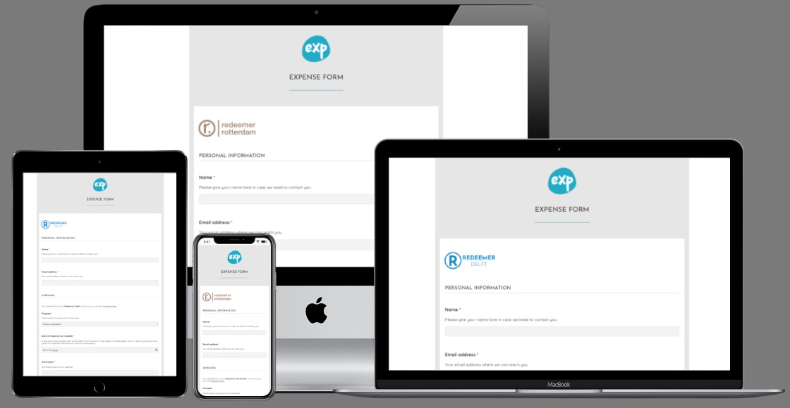
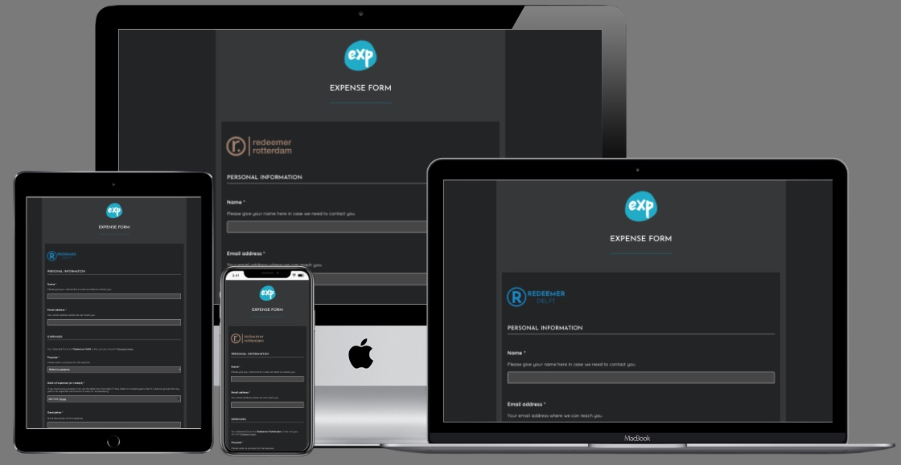

# Expense App

Full-stack web application using `Django REST` framework for backend, `postgreSQL` for database and `ReactJS + Typescript @vite` for frontend. Created for streamlining the expense reinbursement process for Redeemer International Church Rotterdam.

**This App is a `Full Stack` `Progressive Web App (PWA)`, `installable` and `fully responsive` on all devices.**

---

***View the live project here: https://expense-app-11bed11addbe.herokuapp.com/***

---

---

# Motivation

The Redeemer Churches are a network of international christian churches in the Netherlands. I was approached by the Rotterdam Church's finance team with the opportunity to develop a custom web application that could greatly improve their everyday work.

Church members frequently pay for goods and services for the church's benefit which they can later submit to the church for reimbursement. This process usually involves administration from both members and admins, relating to the collection, submission and storage of documents in appropriate file formats. Easing this process would lessen the burden of both parties which subsequently would strengthen engagement.

An earlier solution to this submission process was a WordPress website, which allowed users to upload the receipts alongside their details into a form to be sent to the finance team via email. While this solution helped the end users, the finance team still had substential work with converting and assembling the incoming image files and documents, many times in different file formats into one pdf document. It was desirable to streamline this process further to enhance efficiency and reduce manual workload.

---

# Functionality

This app allows the end-users to submit their expense forms to any of the subscribed churches / organisations, attaching the receipts in various image or pdf formats. The incoming forms and the receipts are converted into one multi-page pdf document, and sent to the respective finance teams.

Admins can register new churches or organisations. In addition to the church's name and finance teams' contact details, they can upload the organisation's logo which makes the forms more recognisable by end users.

When a user submits an expense form, they receive a feedback about the successful submission both on the screen and also via email for later reference. Simultaniously, the admin team receives two emails: one containing the compiled pdf document, ready for the finance team to process, and one ready-written email which, upon approval of the expense claim, can be sent back to the end-user.

The app is a `Progressive Web App (PWA)`, meaning it is installable on any desktop or mobile devices. Caching is also utilised to allow reduced loading times on subsequent usage as well as for offline access.

As per the requirement of the Rotterdam Finance Team, the app does not retain any end-user or expense data. The database only stores the required data of churches/organisations for the purpose of creating the form and sending the generated documents.

Email authentication / registration has purposefully not been implemented in order to make the user experience as smooth as possible. This requirement was stronger than the potential risk of unauthenticated usage, however, this risk is reviewed periodically.

---

# Feedback and collaboration

Feedback is always welcome! Similarly, if you have the time and courage to improve this app, please reach out!

Send your message to [this email](mailto:benches.dory_0b@icloud.com)!

Thank you!
